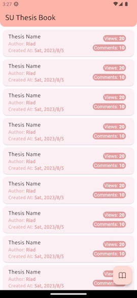

# SU Thesis Book 📚
Thesis Book of Sonargaon University

><b>Platforms:</b> Android, iOS <b>Language/SDK:</b> Dart, Flutter

![coverage][coverage_badge]
[![style: very good analysis][very_good_analysis_badge]][very_good_analysis_link]
[![License: MIT][license_badge]][license_link]

<!-- screenshot is 25% of original resolution  
resized = original / 25
place width, height here as resized / 2 -->
## **🖼️ Screenshots**
&emsp;&emsp;&emsp;<!--   -->

## **🎈 Features**
- < Will be implemented here >
 
## **📝 Remarks**
- Read about [Very Good Core](https://cli.vgv.dev/docs/templates/core) to Run, Structure, Test, Translations, CI/CD and update App Icons.

[coverage_badge]: coverage_badge.svg
[flutter_localizations_link]: https://api.flutter.dev/flutter/flutter_localizations/flutter_localizations-library.html
[internationalization_link]: https://flutter.dev/docs/development/accessibility-and-localization/internationalization
[license_badge]: https://img.shields.io/badge/license-MIT-blue.svg
[license_link]: https://opensource.org/licenses/MIT
[very_good_analysis_badge]: https://img.shields.io/badge/style-very_good_analysis-B22C89.svg
[very_good_analysis_link]: https://pub.dev/packages/very_good_analysis
[very_good_cli_link]: https://github.com/VeryGoodOpenSource/very_good_cli
